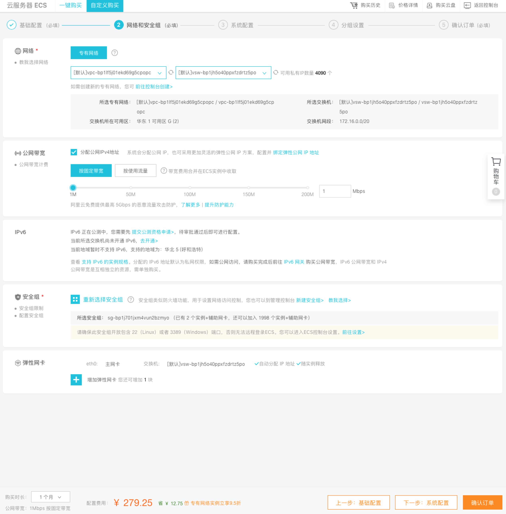

# Installing on Aliyun

## Goal 
By the end of this tutorial, you should have a JupyterHub with some admin users and a user environment with packages you want installing running on [Aliyun](https://www.aliyun.com).

## Prerequisites 
1.  An Aliyun account. You can use your cell phone number to create one or using your Taobao ID.


##  Step 1: Installing The Littlest JupyterHub
Let’s create the server on which we can run JupyterHub.
1. Go to [Aliyun](https://www.aliyun.com/) login in and click the button ‘ to the Console (控制台）’  in the upper right. 

2. On the screen listing of the Products and Services, pick **Cloud Server EC2**  （**云服务器EC2**）on the left side at the top of the first column.

***pic1-Aliyun-English:***


***pic1-Aliyun-Chinese:***
 

3. From the navigation menu listing on the far left side of the **EC2  Console**, choose **Instances** under the light grey **INSTANCES** sub-heading.
***pic2-Aliyun-English:***


***pic2-Aliyun-Chinese:***
 

4. In the main window, towards the top right, click on the bright blue **Create Instance** button.
***pic3-Aliyun-English:***


***pic3-Aliyun-Chinese:***
 

This will start to create your cloud server for jupyterhub. Customise the kind of server you want. 

5. After **Create Instance**, you will have four steps to do： Basic Configurations、Network and Security Group、 System Configurations、 Confirm Order. 

***pic4-Aliyun-English:***
 

***pic4-Aliyun-Chinese:***
 

  * **Basic Configurations**
    
    Billing method
    
    - If you use short-term tests, you can choose a **Preemptible instance**. The cost is usually much cheaper than the other two, but the price will fluctuate, and sometimes it will be more expensive.
    - The **Subscription** package is suitable for jupyterhub that needs to be used online for a long time.
    - The **pay-as-you-go** method is ideal for planning to start and stop Jupyterhub, and you need to close the instance to save money when not in use.

     Region
     
     - Choose the region closest to you 
  
    Instance Type
    
    - Customise the CPU and Memory、Network you need
    - Usually ecs.g5.xlarge is ready for 30 students using.
    - `GPU graphics` and `GPU compute` products are also available

    Image
    - using the public images, choose Ubuntu and the 18.04 64bit 
 
    Storage
    - System Disk.  You can choose the ultra disk with 2120 IOPS, if you need faster, SSD cloud disk is about 25000 , or ESSD disk is 1000000 iops.
    - Data Disk.  Add the data disk if you need more space to store your data in jupyterhub for users.
   
  * **Network and Security Group**
    Network
    - VPC  leave the default if you don’t need creat you own network setting 
 
    Network Billing Method
    - Make sure Assign public IP is choosen
    - Pay-By-Bandwidth and Pay-By-Traffic depending on the content, size and duration of the transmitted data
     
    IPv6
    - IPv6 is in the preview phase by the time 2019.4
  
    Security Group
    - A security group is similar to a firewall. It is used to control connection requests. Can leave it to default if you don’t want to change it.
    
    Elastic Network Interface
    - If you don’t need more network Interface, leave it to default 

***pic5-Aliyun-English:***


***pic5-Aliyun-Chinese:***
 

  * **System Configuration**
    Log on Credentials And Description of your server
    - Using Key Pair or Password to ssh login your server, you can set it up before the instance start.

***pic6-Aliyun-English:***
 

***pic6-Aliyun-Chinese:***
 

  * **Confirm Order**
    Confirm the **Configurations Selected** and **Duration**, then read the **Terms of Service** , if you agree with that, select it and create order.

6.  Under **Step 5** , using your **KeyPair or Password** to ssh login in your server with the public IP shows on instance page.
After login in, copy the text below and paste it,
**Remember to add your username**!

```
curl https://raw.githubusercontent.com/jupyterhub/the-littlest-jupyterhub/master/bootstrap/bootstrap.py \
  | sudo python3 - \
    --admin <admin-user-name>
```

7. When the Jupyterhub creation process finishes and the hub is ready to show the login, the **System Log** should look similar to the image below. Scroll to the bottom of your output from the previous step. Note the line **Starting TLJH installer**, you may also see **Started jupyterhub.service**

 

8. When the installation is complete, it should give you a JupyterHub login page.


9.  Login using the **admin user name** you used in **step 6**, and a password. Use a strong password & note it down somewhere, since this will be the password for the admin user account from now on.

10.  Congratulations, you have a running working JupyterHub!

##  Step 2: Adding more users[](http://tljh.jupyter.org/en/latest/install/amazon.html#step-2-adding-more-users "Permalink to this headline")

Most administration & configuration of the JupyterHub can be done from the web UI directly. Let’s add a few users who can log in!

1.  Open the **Control Panel** by clicking the control panel button on the top right of your JupyterHub.

    
2.  In the control panel, open the **Admin** link in the top left.

    

    This opens up the JupyterHub admin page, where you can add/delete users, start/stop peoples’ servers and see who is online.

3.  Click the **Add Users** button.

    

    An **Add Users** dialogue box opens up.

4.  Type the names of users you want to add to this JupyterHub in the dialogue box, one per line.

    

    You can tick the **Admin** checkbox if you want to give admin rights to all these users too.

5.  Click the **Add Users** button in the dialogue box. Your users are now added to the JupyterHub! When they log in for the first time, they can set their password - and use it to log in again in the future.

Congratulations, you now have a multi-user JupyterHub that you can add arbitrary users to!

## Step 3: Install conda / pip packages for all users[](http://tljh.jupyter.org/en/latest/install/amazon.html#step-3-install-conda-pip-packages-for-all-users "Permalink to this headline")

The **User Environment** is a conda environment that is shared by all users in the JupyterHub. Libraries installed in this environment are immediately available to all users. Admin users can install packages in this environment with `sudo -E`.

1.  Log in as an admin user and open a Terminal in your Jupyter Notebook.

    
2.  Install [gdal](https://anaconda.org/conda-forge/gdal) from [conda-forge](https://conda-forge.org/).
    ```
    sudo -E conda install -c conda-forge gdal
    ```


    The `sudo -E` is very important!

3.  Install `there` with `pip`

    ```
    sudo -E pip install there
    ```

The packages `gdal` and `there` are now available to all users in JupyterHub. If a user already had a python notebook running, they have to restart their notebook’s kernel to make the new libraries available.

See [Install conda, pip or apt packages](http://tljh.jupyter.org/en/latest/howto/env/user-environment.html#howto-env-user-environment) for more information.


